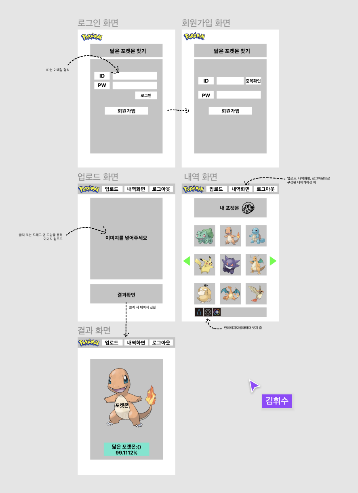

# 기획서

💡 **프로젝트명**

##### - 닮은 포켓몬 찾기
 

💡 **기능**

##### 1. 로그인 / 회원가입
- 회원가입
- 로그인
- 로그아웃 기능

 

##### 2. 사물인식기능
- 사진 업로드
- 업로드 된 사진 로그 저장
- 결과 화면

 

---

💡 **와이어프레임**

##### 회원가입 / 로그인 / 사진 업로드  / 사물인식 기능 / 결과화면

---

💡 **추가 구현**

- GIT의 Pull Request를 요청시 팀원 중 한 명이 코드를 검토후 코멘트, 리뷰가 끝나면 Merge를 진행
- 백엔드 개발에 Postman을 적극 활용
- jQuery대신 javascript를 이용해서 프론트엔드를 작성
- Flask 블루프린트를 사용해서 API 모듈화
- 공유하기 만들기 → 결과 화면
